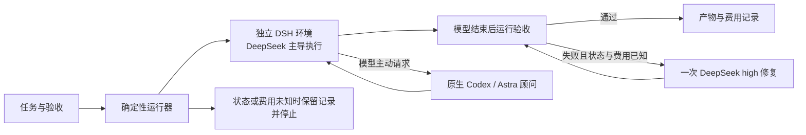

# 产品判断：做廉价模型的可靠执行入口，重点验证按需升级

**建议继续投入一个有明确验证门槛的小型原型。** 从 Astra 始终主控，转向 DSH 主控是合理的：
高级模型不参与每轮派工和读日志，执行器、验收、计费和恢复由程序连接。现有证据支持
便宜模型完成明确任务的潜力，尚不支持“接上专家就获得 90% 顶级能力”。

## 面向用户的产品

使用者给出项目、任务、可运行的验收和预算，收到合格产物或带证据的停止原因。
默认选择便宜路径，遇到有依据的能力缺口才增加模型投入。产品承诺应围绕
**在给定预算和等待时间内，尽可能多地完成合格任务**；“十分之一成本、接近顶级交付”保留为
有吸引力的研究目标，以冻结任务集的整组结果验收。

首个落点是已有测试的仓库维护：边界清楚的修复、接口补全、重构、测试完善。开放需求、
缺少验收的整站开发暂不作为首批承诺，因为无法低成本判断模型究竟完成了什么。
CLI 适合开发者先用；CI/编辑器可以以后复用相同 JSON 接口。Skill 可以作为入口说明，
状态与预算控制需要放在可测试的程序中。

## 当前能交付的技术方案

实现就在 [prototype/](../../prototype/README.md)：独立 Host/home/preset；DSH Session API；
原生 MCP 顾问；固定任务目录与共享占用；父子会话计量；咨询请求去重；独立验收及一次修复；
保存请求 ID、只读检查和只回收自有进程。没有另起一个通用 agent 平台。

该方案可行的部分已经真实调用验证。通用 `task.mjs run` 是最后组合的新入口，尚未完成付费
端到端实测；跨系统真实模型与进程树清理也未验证。默认 Flash/high 来自已观察到的质量取舍，
不是全局最优路由。Pro 价目与路由可配置，但本轮未执行 Pro，不能推荐它优于 Flash。

## 真正需要解决的升级决策

当前 DSH 在失败时也没有咨询 Astra。不能把模型自述“有信心”当成路由依据。
下一轮应比较以下路径，所有路径获得相同验收反馈、截止时间和最多修复次数：

| 路径 | 要回答的问题 |
|---|---|
| 原生 Astra | 同一约束下强模型本身能完成多少、花多少、多久 |
| 较强的便宜主模型（Flash/high 或 Pro） | 是否简单换主模型就已达到更好的成本/质量平衡 |
| DSH + 失败后有限专家诊断 | 专家能否解决便宜模型修复不了的问题，且省过整项接管 |

不要先训练“智能路由器”。先建立一个有边界的失败分类器：测试语义失败可送诊断；缺 key、
端口冲突、权限拒绝、服务超时、未知费用走运行恢复；缺少需求要明确停止或请求信息。
专家只收到需求、相关差异、失败输出和已尝试的修复；返回诊断、最小修改建议及需验证事项。
执行仍留在 DSH。失败驱动的专家自动诊断是**下一项待做的实验功能**，并未冒充本轮已有能力。

特别需要分辨“专家建议有用”与“只是多得到了一次机会”。可在便宜路径首次失败后冻结相同
代码快照，随机分配同样一次 cheap repair / expert-assisted repair；控制给出的失败信息。
没有失败样本或两边都能修好，便不能说专家有增量。若较强便宜模型已经更好，就保留简单方案。

## 预算约束揭示的可行区间

设便宜执行与验收平均费用为 c，一次专家介入连同后续修复的增量费用为 e，介入比例为 p，
强模型完整任务平均费为 H。忽略其他额外费用时，目标至少要求：

`c + p × e ≤ 0.1 × H`

例如假设 H=$0.40、c=$0.02、e=$0.10，专家介入最多约 20% 才留在十分之一以内。
这只是算术情景，e 不是本轮短探针的费用预测；质量还必须单独达标。
高思考强度 Flash 在当前三题的峰时费用已超过 10% 线，继续加专家本身不能降低费用。
因此有三个实质方向：降低常规路径耗费、减少需要升级的比例，或用专家减少更多后续返工。
必须观察整组任务费用与合格交付数，不能只优化单次调用价格。

本轮已消除每个任务外部 Astra 主控轮询的架构需要，但没有测得原型研发和长期维护的摊销。
不能从局部 token 或 API 价格推导“20 美元套餐媲美 200 美元套餐”。

## 下一轮投入门槛

1. **先修测量和运行入口。** 费用未知时阻止付费已经生效；补齐原生重连的归因证据或明确
   可核对的账单来源。验证新 CLI 的安装、缺 key、Host 恢复、断线、只读检查及退出清理。
   不以无限重试解决统计缺失，也不靠放宽审批使成功率更漂亮。
2. **再做 20 个预先冻结的真实仓库任务筛查。** 包含多个仓库和难度，记录强基线实际成功数；
   先补完新题对照而不使用已调优三题当留出集。比较较强便宜主模型和有限专家升级，冻结
   每任务截止及可接受等待差。所有失败、返工、接管和费用未知都保留。
3. **满足信号后才扩大到 100+ 独立任务和外部试用。** 筛查目标可设为费用不超过 15%、
   合格交付数不少于强基线的 90%，关键交互任务不得靠三倍等待换结果；15% 是继续验证的
   门槛，不是把 10% 宣传目标改称已完成。20 题只能筛查，确认广泛 90/10 需要更大样本、
   重复运行和置信区间。若专家没有净增益，就去掉它；若都不达标，就收窄场景。

这些是下一阶段建议，**本轮没有偷偷启动额外付费实验**。本轮遇到原生费用未知后停止扩张，
完整保留失败。已有成果足以做一次可审查的 alpha，尚不足以作为成熟无人值守产品收费。
